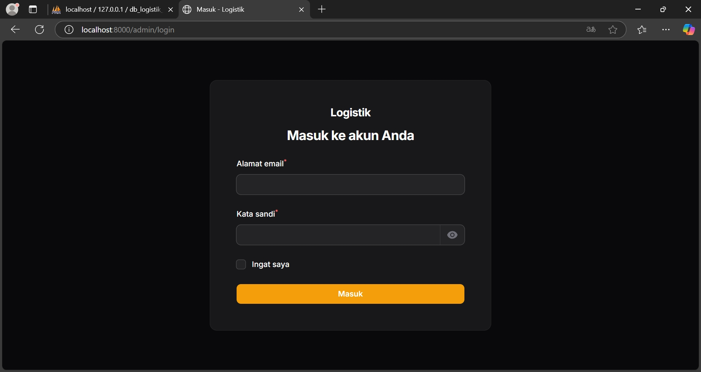
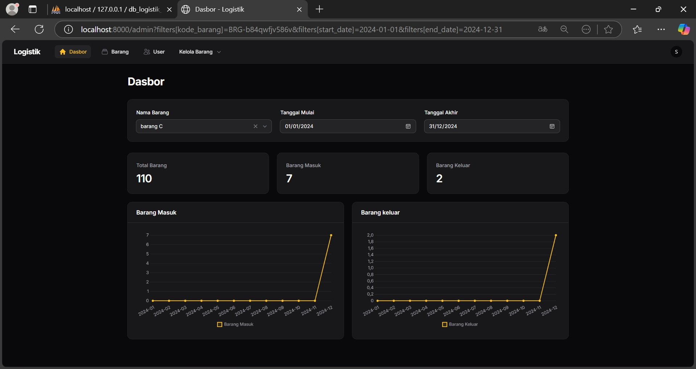
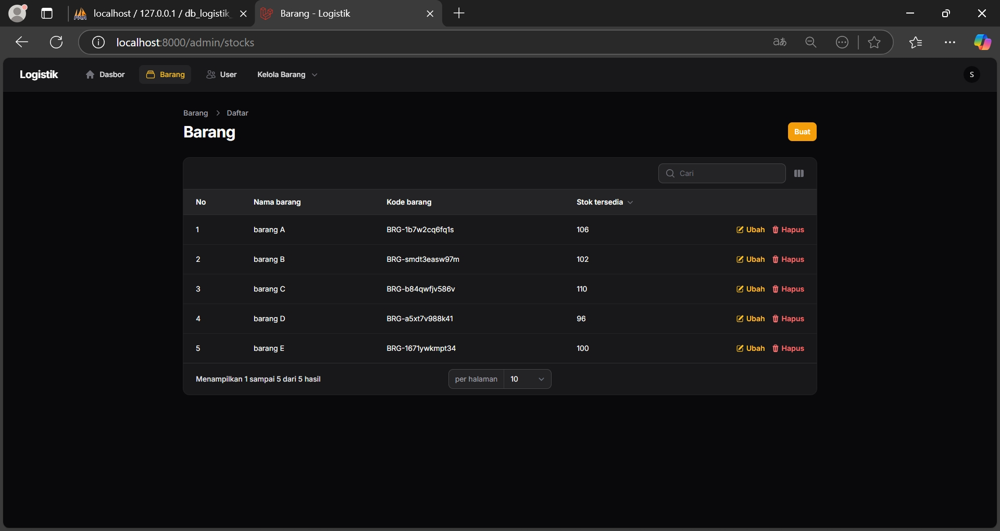
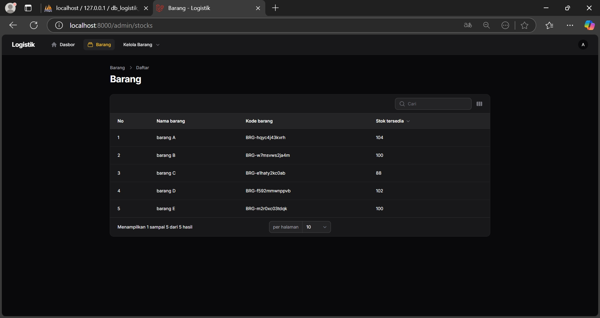
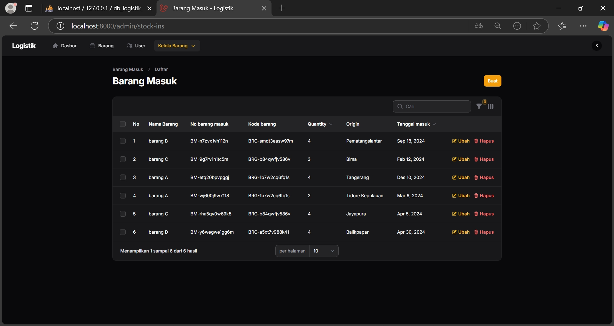
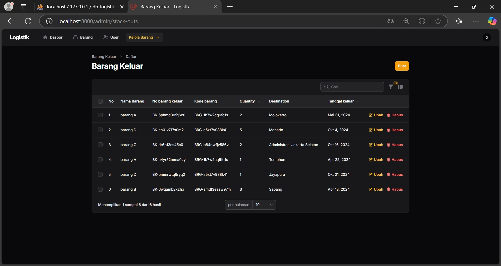
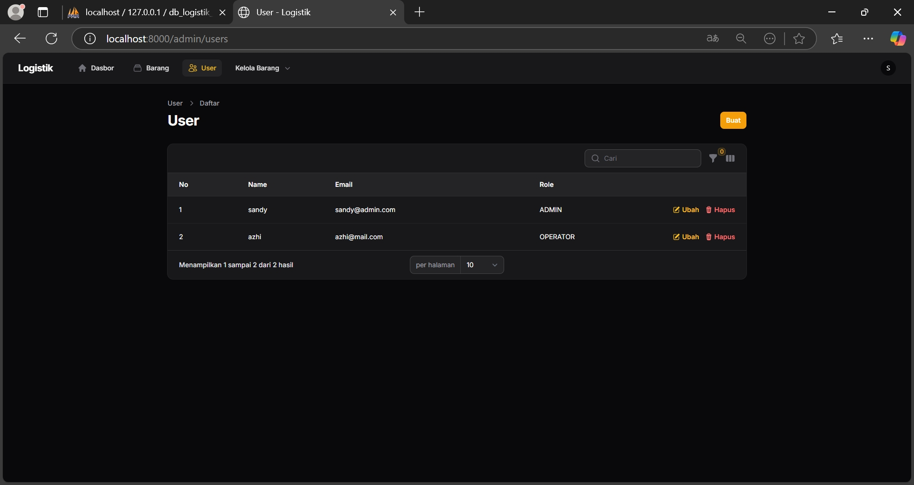

# Aplikasi Logistik

Ini adalah aplikasi logistik yang dirancang untuk mengelola barang masuk dan barang keluar. Kedua fitur ini saling terhubung untuk memberikan pelacakan yang komprehensif.

---

## Petunjuk Setup

1. Untuk mengatur database, jalankan perintah berikut:

    ```bash
    php artisan migrate --seed
    ```

    Atau, Anda dapat mengimpor database secara langsung menggunakan file yang disediakan:
    `db_logistik_nursandyihksan.sql`.

2. Saat pertama kali membuka aplikasi, Anda akan disambut dengan halaman login. Gunakan salah satu account berikut:

**Contoh Gambar:**


    | Email           | Password | Role     |
    | --------------- | -------- | -------- |
    | sandy@admin.com | 123      | Admin    |
    | azhi@mail.com   | 123      | Operator |

---

## Fitur Aplikasi

### Dashboard

Dashboard dilengkapi dengan filter untuk `nama_barang`, `Tanggal Mulai`, dan `Tanggal Akhir` untuk mempermudah tampilan data.

**Contoh Gambar:**


---

### Menu Barang

Menu ini digunakan untuk memanipulasi data barang, termasuk:

-   Membuat barang baru
-   Mengedit barang
-   Menghapus barang

**Contoh Gambar:**


**Catatan:** Operator hanya dapat melihat data di menu ini dan tidak memiliki izin untuk melakukan perubahan.

**Contoh Gambar (Tampilan Operator):**


---

### Menu Kelola Barang

#### Submenu: Barang Masuk

Submenu ini digunakan untuk mengelola barang masuk, termasuk:

-   Menambahkan data baru
-   Mengedit data
-   Menghapus data

**Contoh Gambar:**


#### Submenu: Barang Keluar

Submenu ini digunakan untuk mengelola barang keluar, termasuk:

-   Menambahkan data baru
-   Mengedit data
-   Menghapus data

**Contoh Gambar:**


---

### Menu User

Menu ini digunakan untuk mengelola data pengguna, termasuk:

-   Membuat pengguna baru
-   Mengedit pengguna
-   Menghapus pengguna

**Contoh Gambar:**


**Catatan:** Menu ini hanya dapat diakses oleh pengguna dengan role Admin. Operator dan role lainnya tidak dapat mengakses menu ini.

---

## Catatan Tambahan

-   Pastikan lingkungan Anda sudah dikonfigurasi dengan benar untuk menjalankan aplikasi Laravel.
-   Untuk bantuan lebih lanjut, lihat dokumentasi Laravel atau hubungi pengembang aplikasi.
